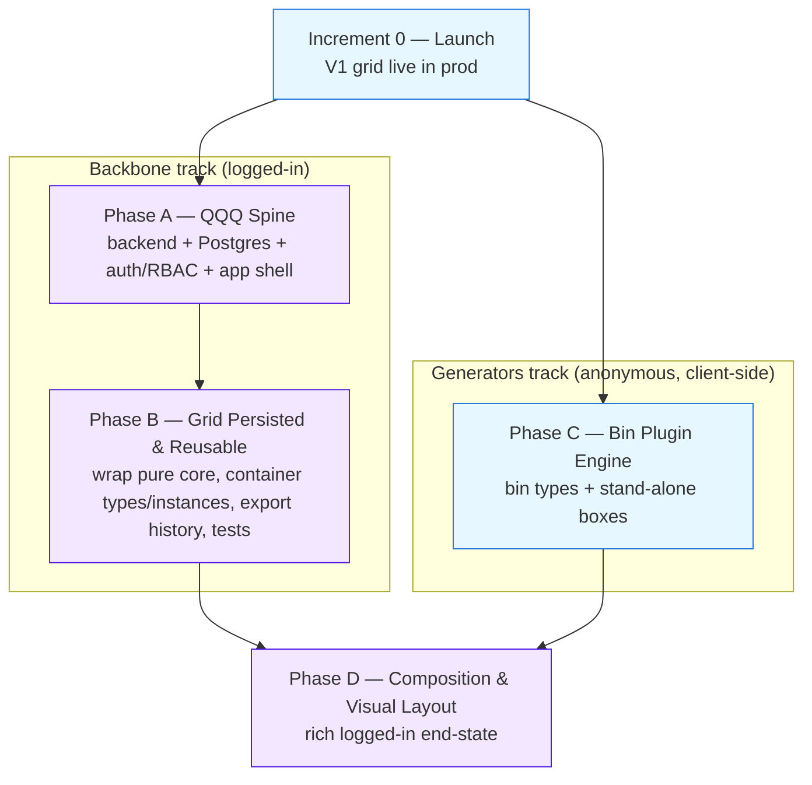

# Benchfinity Roadmap

> **North Star:** Design and print an entire workshop organization system — grids, bins, and stand-alone boxes — in one open-source place.

This is the authoritative phase plan for Benchfinity. It supersedes the older single-bucket `Workbench VNext` plan in scope sequencing; `docs/PRODUCT-VISION.md` remains the authoritative product vision and `AGENTS.md` the operational guide.

## Operating principles

- **Continuous delivery / ship small to prod.** Every increment is independently shippable. Small changes land in production continuously rather than in big-bang releases.
- **Launch then build.** Increment 0 puts the existing V1 grid generator live first; product depth is added against a running, public app.
- **Pure core preserved (issue #5).** The V1 generator core (`src/geometry/*`, `src/validation.ts`, `src/export/*`) plus `src/design.ts`/`src/geometry/types.ts` stay pure (no React/DOM/storage) and are **wrapped, never rewritten**. Persistence stores `PlateInput` + `selectedPrinterId` + `schemaVersion` (`BaseplateDesign`) and a JSON-safe projection of the derived `PlateLayout`; Three.js meshes are never persisted — they are recomputed on load.
- **Two parallel tracks.** A *backbone* track (logged-in, **A → B**: backend + Postgres + auth/RBAC + app shell, then the persisted/reusable grid) runs in parallel with a *generators* track (anonymous, client-side, **C**: the bin plugin family and stand-alone boxes shipping straight to the live anonymous app). The two tracks are decoupled by the auth gate, so anonymous generate → preview → export keeps working unchanged throughout.

## Phase flow (two-track parallelism)

Increment 0 unblocks both tracks. The backbone (A → B) and the generators track (C) then proceed in parallel; both feed the Phase D rich end-state.

---

## Increment 0 — Launch: V1 grid live

**Goal:** Get the existing anonymous client-side V1 grid generator live in production at `benchfinity.com` on Talos `k8s-prod` via a new `benchfinity-cd` GitOps repo. Deployment only — no app features, no backend, no auth. This is the launch-then-build beachhead the whole continuous-delivery model depends on.

> **Lineage:** builds on the closed Repository Foundation work (#9), which already produces the multi-arch GHCR image `ghcr.io/benchfinity/workbench` (rolling `:develop` + immutable `:<version>-SNAPSHOT.<sha>`) and the OCI Helm chart `oci://ghcr.io/benchfinity/charts/benchfinity`.

### 0.1 — Scaffold the Benchfinity-CD GitOps repo from the Website-CD pattern

- **Ships to prod:** Repo scaffold only; nothing live yet. Foundation for 0.2–0.4.
- **Summary:** Create a new public repo `BenchFinity/benchfinity-cd` (clone at `/Users/james.maes/Git.Local/benchfinity/benchfinity-cd`) modeled on `/Users/james.maes/Git.Local/Kof22/Website-CD`. Because Benchfinity ships a **Helm chart** while Website-CD is raw Kustomize, the CD repo must **wrap the published OCI chart** rather than re-vendor manifests — recommended: an ArgoCD Application with inline per-env Helm values (`base/` + `overlays/production/`), honoring the issue #5 "wrap, never rewrite" principle at the deploy layer too. The workbench repo only builds the image and publishes the chart; the CD repo is the single source ArgoCD syncs.
- **Key tasks:**
  - `gh repo create BenchFinity/benchfinity-cd --public`; clone locally.
  - Directory layout mirroring Website-CD: `base/`, `overlays/production/`, `argocd/`.
  - `base/values.yaml` for cross-env-stable chart defaults (`frontend.enabled=true`, replicas, resources from `deploy/helm/benchfinity/values.yaml`).
  - `overlays/production/values.yaml` for prod overrides (ingress, host `benchfinity.com`, className `traefik`, cert-manager + Traefik annotations, TLS, frontend HA).
  - `AI_STARTHERE.md` + `README.md` documenting the repo role, `main` branch, and ArgoCD sync target.
  - Document that the image is **PUBLIC** (verified anon pull of `ghcr.io/benchfinity/workbench:develop` returns 200) — **no imagePullSecret**; do not copy kof22's private-registry assumptions.
  - Keep all OCI references lowercase (`ghcr.io/benchfinity/...`) despite the `BenchFinity/Workbench` GitHub casing.
- **Dependencies:** none.
- **Maps to issues:** Increment 0 (Launch) — new issue *"Increment 0: Create Benchfinity-CD GitOps repo (ArgoCD + Kustomize)"*.

### 0.2 — Wire the ArgoCD Application to sync the published chart into the cluster

- **Ships to prod:** Frontend pods running in-cluster (ClusterIP), reachable via port-forward; not yet publicly exposed.
- **Summary:** Create the ArgoCD Application (modeled on `deploy/argocd/application.yaml`, repointed at the CD repo) deploying into a dedicated `benchfinity` namespace with automated prune + self-heal and `CreateNamespace=true`. For a controlled first launch, pin an immutable `:<version>-SNAPSHOT.<sha>` tag; document the upgrade path to ArgoCD Image Updater digest-tracking on `:develop` for true CD.
- **Key tasks:**
  - `benchfinity-cd/argocd/application-production.yaml`: `repoURL` → CD repo, `targetRevision=main`, `source=overlays/production`.
  - `destination.namespace=benchfinity`, `syncPolicy.automated{prune:true,selfHeal:true}`, `syncOptions[CreateNamespace=true]`.
  - Helm source mode: chart `benchfinity` from `oci://ghcr.io/benchfinity/charts`, with overlay values (or multi-source: git values + OCI chart).
  - Override `frontend.image.tag` in the overlay (chart appVersion is decoupled from the image tag).
  - Apply and confirm Healthy/Synced; `kubectl get pods -n benchfinity` shows the frontend Running (no pull secret).
- **Dependencies:** 0.1.
- **Maps to issues:** Increment 0 (Launch) — new issue *"Increment 0: Deploy V1 grid generator to production"*.

### 0.3 — Configure Traefik ingress + TLS + static-IP exposure for benchfinity.com

- **Ships to prod:** `benchfinity.com` served over HTTPS through Traefik on the static IP once DNS (0.4) resolves; HTTP redirects to HTTPS.
- **Summary:** Expose the frontend publicly over HTTPS via the cluster Traefik ingress on the dedicated static IP, with cert-manager issuing a Let's Encrypt cert. Replicate the Website-CD two-Ingress pattern: a `websecure` Ingress carrying the `cert-manager.io/cluster-issuer` annotation + a `tls` block, plus a separate `web`-entrypoint HTTP→HTTPS redirect. The Benchfinity chart renders only **one** Ingress with no redirect/middleware support, so the redirect is added out-of-band in the overlay.
- **Key tasks:**
  - Overlay `ingress.enabled=true`, `className=traefik`, host `benchfinity.com` (path `/` → frontend).
  - `cert-manager.io/cluster-issuer: letsencrypt-prod` (confirmed present and `Ready=True` on `k8s-prod`; Website-CD happens to use `zerossl-production`), `traefik.ingress.kubernetes.io/router.entrypoints: websecure`.
  - `ingress.tls: [{hosts:[benchfinity.com], secretName: benchfinity-tls}]`.
  - HTTP→HTTPS redirect via a Traefik redirect middleware annotation or an extra overlay manifest modeled on `kof22-website-ingress-http-redirect.yaml`.
  - Confirm static-IP exposure is via the shared cluster Traefik LoadBalancer (apps are ClusterIP behind it; no per-app `loadBalancerIP`); verify Traefik's external IP.
  - Decide www handling (apex + optional `www` SAN).
- **Dependencies:** 0.2.
- **Maps to issues:** Increment 0 (Launch).

### 0.4 — Point DNS (Route 53) at the static IP and verify public anonymous HTTPS load

- **Ships to prod:** **`benchfinity.com` is LIVE** — public, anonymous V1 grid generator with 3D preview and STL/3MF/ZIP export over valid HTTPS. Increment 0 complete.
- **Summary:** Create the Route 53 A record for `benchfinity.com` → dedicated static IP, wait for the cert to issue, then verify end-to-end: HTTPS resolves with a valid cert, the app loads anonymously, and the no-account generate → 3D preview → STL/3MF export flow works.
- **Key tasks:**
  - Route 53 apex A record → static IP (+ `www` if in scope); confirm `dig`.
  - Confirm `kubectl get certificate -n benchfinity` shows `Ready=True`.
  - `curl -I https://benchfinity.com` → 200 valid LE cert; `http://` → 301/308.
  - Verify anonymous app end-to-end (generate grid, render 3D, export STL + 3MF).
  - Fix stale `docs/DEPLOY.md` sections 1 & 4 that claim the image is private / a pull secret is required (verified false); add a pointer to `benchfinity-cd` as the prod GitOps source of truth.
- **Dependencies:** 0.3.
- **Maps to issues:** Increment 0 (Launch).

> **Sequencing note:** Let's Encrypt HTTP-01 cannot issue until DNS resolves to the static IP and :80 is reachable — a chicken-and-egg with 0.3. Mitigate by using a DNS-01 (Route 53) solver, or accept a short Pending window until DNS propagates.

---

## Phase A — QQQ Platform Spine

**Goal:** Stand up a QQQ + Postgres backend, ground the persistence schema in the confirmed `Account → System → ContainerType → ContainerInstance → Inserts` hierarchy, add pluggable auth + account-scoped RBAC, and ship a signed-in React app shell that calls QQQ's auto-generated REST API via `qqq-frontend-core`. The pure geometry/export core and the Three.js generator UI are **not touched** here — Phase A only builds the spine that Phase B wraps them behind. Runs in parallel with the anonymous generators track (Phase C).

> **QQQ-cheap vs custom split (core Phase A principle):** QQQ makes the persistence/operational tier nearly free — metadata-defined Postgres CRUD, auto-generated REST + OpenAPI 3, a Material-UI admin dashboard for **internal ops only** (never embedded in the product), QProcesses, RBAC (`qbit-user-role-permissions` + `QPermissionRules`), pluggable auth/sessions, Quartz scheduling. The differentiators get zero help and stay custom: the React + Three.js generator UI and the anonymous shareable-link UX. Adopting QQQ is a deliberate shift from client-only (~$0/mo) to client + Java 21/Javalin/Quartz + Postgres, justified by the accounts/persistence goal **and** the explicit QQQ + agentic-process showcase — not by revenue (free + sponsorware, AGPL-3.0).
>
> **Pin everything, budget for thin docs:** org renamed Kingsrook → QRun-IO but Maven coords remain `com.kingsrook.qqq`; README-stable (v0.35.0) lags the latest tag (v0.40.0). Pin a specific QQQ + `qbit-bom` version and verify coordinates; authoritative knowledge is the source on `develop` and `qqq-sample-project`.

### A1 — QQQ + Postgres backend scaffold (the spine, free CRUD/REST/admin)

- **Summary:** Stand up the QQQ Java backend as a sibling app inside this repo's existing backend slot (the Helm chart, compose `full` profile, and CI already reserve a backend image + Postgres + MinIO). Bootstrap from `qqq-app-starter`/`new-qqq-application-template` (`qqq-backend-core` + `qqq-backend-module-postgres`/`-rdbms` + `qqq-middleware-javalin` + `qqq-openapi`), pinned to a concrete release. Resolves the #1 repo/app-shape question: backend lives **in-repo as a separate Maven module** (e.g. `/server`) producing `ghcr.io/benchfinity/workbench-api`, matching the disabled `backend.image` already in `values.yaml`/`compose.yaml`. Deliverable: a running QQQ instance with a trivial smoke table proving auto-generated REST + OpenAPI + the admin dashboard come for free. No product schema yet (that is A2). Pure core and Three.js UI untouched.
- **Key tasks:**
  - Resolve #1: document the in-repo sibling-module decision in a new ADR and update `AGENTS.md` architecture boundaries.
  - Pin `com.kingsrook.qqq` artifacts in `pom.xml`; configure `PostgreSQLBackendMetaData` from env (`DATABASE_*`, password via `secretKeyRef` — names already defined by the Helm `backend-deployment` template; Javalin on `backend.containerPort` 8080).
  - Define one trivial `QTableMetaData` to verify auto-REST + OpenAPI 3 + Material-UI admin dashboard against local Postgres.
  - Wire the QQQ backend into the compose `full` profile (already has backend + `postgres:16` + minio) so `docker compose --profile full up` runs frontend + QQQ + Postgres locally.
  - Add a Java 21 Dockerfile producing `workbench-api` (separate from the frontend distroless nginx Dockerfile).
  - Add a Maven build + minimal backend CI job so the HIGH+ security gates and PR checks extend to the Java module.
- **Dependencies:** none (within Phase A).
- **Maps to issues:** #1 (rewritten → *"Phase A: Confirm QQQ backend repo, app shape, and local dev run"*).

### A2 — Postgres persistence schema grounded in the confirmed hierarchy

- **Summary:** Model the confirmed hierarchy as QQQ tables over Postgres: `account → system → container_type → container_instance → insert`, plus `user`, `account_membership`, `export_artifact`, `printer_profile`, and a discriminated `Part/WorkbenchItem` table carrying `partType` + `schemaVersion`. Resolves #2. The serializable unit already exists client-side: `BaseplateDesign` (`src/design.ts`: `schemaVersion` + `PlateInput` + `selectedPrinterId`) and the derived `PlateLayout` (`src/geometry/types.ts`). Persist `PlateInput` + derived `PlateLayout` as JSONB (never Three.js meshes — recompute on load), promoting key filterable fields (finished width/depth, cell size, tile count, `partType`) to structured columns. Each part type is a discriminated row (`gridfinityBaseplate` first; bins/boxes added later by Phase C as new `partType` values + schemaVersion bumps) so the open-ended generator family persists without schema forks. The pure core is wrapped, not rewritten (#5).
- **Key tasks:**
  - Define `QTableMetaData` for `account`, `user`, `account_membership`, `system`, `container_type`, `container_instance`, `insert`, `component_library_part`, `printer_profile`, `export_artifact`.
  - Map the client model into columns: store `PlateInput` + `selectedPrinterId` + derived `PlateLayout` as JSONB; promote finishedWidth/Depth/unit, cell size, tile count, `partType` to structured columns.
  - Conventions: UUID PKs, slugs on account/system/container, integer `revision` or `updated_at` for optimistic concurrency, `createdAt`/`updatedAt`, JSONB for versioned payloads.
  - Carry `schemaVersion` (`DESIGN_SCHEMA_VERSION`, currently 1) on every persisted part.
  - Indexes for account-scoped listing: `(account_id)`, `(system_id)`, `(container_type_id)`, `(account_id, part_type)`.
  - `ExportArtifact` metadata in Postgres (exportType, version, filename, contentType, sizeBytes, storageKey, input hash) with binaries in MinIO/S3 (objectStore env already in the chart) — anchors the #3 storage decision.
  - Backend tests for CRUD and the JSONB round-trip of `PlateInput`/`PlateLayout`.
- **Dependencies:** A1.
- **Maps to issues:** #2 (rewritten → expanded to the confirmed `System/ContainerType/ContainerInstance/Inserts` hierarchy; the older `account/project/workbench_item` draft in `WORKBENCH-VNEXT.md` is superseded).

### A3 — Auth + account-scoped RBAC (accounts, membership, access rules)

- **Summary:** Add authentication and account-scoped authorization so all stateful features sit behind an account boundary, while the anonymous generate → preview → export path stays fully public. Auth provider choice is **OPEN and resolved here** (ADR): Authentik (already in the founder's stack, via QQQ's OAuth2 module) vs a simpler QQQ table-based / Auth0 option. RBAC uses `QPermissionRules` + the `qbit-user-role-permissions` QBit to enforce owner/admin/member/viewer roles scoped by `account_membership`: every System/ContainerType/Insert/ExportArtifact query is filtered by `account_id`. Crucially, the anonymous public surface is **not** QQQ "record sharing" (that is authenticated scope-based sharing) — it is the public read path on QQQ's `FullyAnonymousAuthenticationModule`, which the Phase C generators track and any future share-link feature lean on.
- **Key tasks:**
  - ADR the auth provider decision; configure the chosen QQQ auth module + session handling.
  - Add `qbit-user-role-permissions`; map owner/admin/member/viewer onto `account_membership`.
  - Account-scoped security filters via `QPermissionRules` on all reads/writes.
  - Role policy: owners/admins manage account + members; members create/edit systems & parts; viewers read + download exports.
  - Stand up the anonymous public path on `FullyAnonymousAuthenticationModule` (read-only / no persistence), distinct from authenticated sharing.
  - Tests proving account scoping (user in account A cannot read/write account B's data).
- **Dependencies:** A1, A2.
- **Maps to issues:** #2 — new issue *"Phase A: Decide auth/account provider (Authentik vs embedded)"*.

### A4 — Signed-in React app shell calling the QQQ REST API

- **Summary:** Build the authenticated app shell as a **separate custom frontend surface** calling QQQ's auto-generated REST API via the `qqq-frontend-core` TypeScript client — explicitly **not** the QQQ Material-UI admin dashboard (internal ops only, never embedded). Resolves #4. The shell adds an account switcher + System/Container navigation, a top bar (item name, save status, export action, user menu), and the route structure (account / system / container / item / settings) **around** — not replacing — the existing generator. The current generator already stores its state as the exact `BaseplateDesign` payload in localStorage via `settings.ts`; A4 introduces sign-in and navigation/persistence affordances while preserving the local generate flow. This is the seam Phase B fills in. Three.js preview and pure geometry/export core untouched (#5).
- **Key tasks:**
  - Account switcher, System/Container navigation, top bar, route structure for account/system/container/item/settings.
  - Integrate `qqq-frontend-core` against the QQQ OpenAPI for typed REST access; do not fork/embed `qqq-frontend-material-dashboard`.
  - Wire sign-in/sign-out; gate stateful routes behind auth while leaving the anonymous flow fully usable signed-out.
  - Mount the existing generator inside the item route reading/writing the same `BaseplateDesign` shape; keep localStorage as the anonymous draft store; add "save to account" as the authed action.
  - Keep `App.tsx` top-level orchestration only and generator components presentational (AGENTS.md boundaries).
  - Frontend tests for auth-gated routing and the API client contract (mock the QQQ REST layer).
- **Dependencies:** A1, A2, A3.
- **Maps to issues:** #4 (kept; minor vocabulary alignment to System/Container hierarchy).

---

## Phase B — V1 Grid Persisted & Reusable

**Goal:** Wrap the pure baseplate generator as the first saved part type behind the Phase A QQQ/Postgres/auth spine; add ContainerType/ContainerInstance reuse, export history + artifact storage, and tests. **Hard constraint #5:** `src/geometry/*`, `src/validation.ts`, `src/export/*` stay pure and are **wrapped, never rewritten** — persist `PlateInput` + derived `PlateLayout` only; recompute Three.js meshes on load. Depends on Phase A delivering the QQQ backend, Postgres, auth provider, Account/User/Membership + RBAC, and the signed-in shell. Every increment is independently shippable; the anonymous app keeps working unchanged because all persistence is auth-gated.

> **Wrap seam is real and already designed for:** `BaseplateDesign` carries `DESIGN_SCHEMA_VERSION=1` and is documented as "the persistence payload the Workbench (VNext) will store." #5 is honored by treating geometry/validation/export as read-only: `deriveLayout(input)` and `createPlateModels(layout,input)` are **called** on load, never reimplemented or serialized. `PlateLayout.tiles` carry numeric specs (safe) but `TileModel`/`GeometryPart` carry `BufferGeometry` (not safe, not persisted).
>
> **Suggested ship order:** B0 (pure, zero-risk, freezes the seam) → B1 (schema, needs the Phase A backend live) → B2 (save/load UI) → B3 (export history + storage) → B4 (tests, gates each).

### B0 — Serialization contract & version boundary for the pure core (the wrap seam)

- **Ships to prod:** **Yes** — pure frontend refactor, no backend dependency. Ships to the live anonymous app with zero user-visible change; de-risks every later increment by freezing the wrap seam first.
- **Summary:** Establish the explicit, tested serialization boundary **before** any persistence is wired. Promote `BaseplateDesign` to the canonical save payload, add a serialize/deserialize pair plus a forward-compatible migration shim, and define what derived layout metadata is persisted vs recomputed. This is the single seam honoring #5.
- **Key tasks:**
  - New pure `src/persistence/baseplateRecord.ts`: `SavedBaseplate = { schemaVersion, design: BaseplateDesign, derived: PersistedLayoutMeta }` where `PersistedLayoutMeta` is a JSON-safe projection of `PlateLayout` (cols, rows, grid/padding/printable mm, tile count + summaries, errors, warnings) — **never** `BufferGeometry`/`TileModel`/meshes.
  - `serializeBaseplate(...)` calls the **existing** `deriveLayout(input)` (do not reimplement); `deserializeBaseplate(record)` returns the inputs `App` already feeds into `deriveLayout`/`createPlateModels`.
  - `migrateBaseplateRecord(raw)` keyed on `schemaVersion` (identity for v1).
  - New pure `src/persistence/inputHash.ts`: `stableStringify` + a small synchronous hash (e.g. FNV-1a) over the canonical `BaseplateDesign`, so "does the latest export match the current design" (#7) is decidable identically on client and server.
  - Refactor `App.tsx` **only** at the orchestration layer to round-trip through serialize/deserialize (no behavior change for anonymous flow).
  - Tests: round-trip stability, projection excludes meshes, v1 migration identity, hash stability + sensitivity.
- **Dependencies:** none.
- **Maps to issues:** #5, #6.

### B1 — Persistence model & account-scoped schema (QQQ tables + Postgres migrations)

- **Ships to prod:** **Yes** — additive schema + migrations behind auth; no anonymous-flow change. Ships once Phase A's backend/Postgres/auth are live.
- **Summary:** Implement the durable schema for the saved-grid slice on top of Phase A's Account/User/Membership, reconciling the two documented vocabularies: `WORKBENCH-VNEXT.md`'s Project/WorkbenchItem (older draft) and `PRODUCT-VISION.md`'s authoritative `System → ContainerType → ContainerInstance → Inserts`. Phase B implements `System` (= Project), `ContainerType` (the measured drawer + its reusable grid, storing the `BaseplateDesign` JSONB + derived `PlateLayout` projection + structured filter columns), `ContainerInstance` (drawer 1..N reusing the same grid, unique contents), plus `printer_profile` and `export_artifact`. UUID-keyed, account-scoped, with revision-based optimistic concurrency.
- **Key tasks:**
  - QQQ tables scoped by `account_id`: `system`, `container_type` (FK `system_id`; `BaseplateDesign` JSONB + derived `PlateLayout` JSONB from B0 + structured cols: cols, rows, finished_w/d_mm, tile_count, validation_ok), `container_instance` (FK `container_type_id`; ordinal 1..N; unique per-instance contents/notes), `printer_profile`, `export_artifact` (defined in B3).
  - Conventions: UUID PKs (`gen_random_uuid`), slugs, integer `revision` (bump on update; reject stale writes with 409), audit columns, JSONB for versioned payload, structured columns only for listing/filtering fields.
  - Non-bypassable account-scoping security filter on every table (mirrors Phase A RBAC roles).
  - Indexes: `(account_id, system_id)`, `(account_id, container_type_id)`, unique `(account_id, system_slug)`, `(account_id, updated_at desc)`.
  - Forward/backward idempotent migrations + a dev seed (one account/user/System with one ContainerType + 12 ContainerInstances to exercise the identical-drawers case).
  - Persist `schemaVersion` alongside the JSONB so `migrateBaseplateRecord` can run on load.
- **Dependencies:** B0.
- **Maps to issues:** #2, #6. Record the vocabulary mapping (PRODUCT-VISION canonical) in an ADR.

### B2 — Save / load the baseplate behind the app shell (wrap the generator as the first saved part)

- **Ships to prod:** **Yes** — anonymous flow ships unchanged immediately; logged-in save/load lights up the moment B1's backend is reachable. The two paths are decoupled by the auth gate.
- **Summary:** Inside the Phase A signed-in shell, a saved `ContainerType` **is** the wrapped V1 generator. Existing `PlateControls`/`WorkspacePanel`/preview/validation/STL/ZIP/3MF behavior is preserved verbatim; App-level orchestration gains save/load that round-trips through the B0 seam to the B1 backend. Anonymous users keep the exact current single-part experience (no save). Logged-in users persist a ContainerType, reload it with identical preview-relevant state, and stamp N ContainerInstances that reuse the one grid (the headline "12 identical drawers" case).
- **Key tasks:**
  - New `src/persistence/api.ts` wrapping QQQ/REST CRUD for system + container_type + container_instance; account-scoped server-side.
  - Save/load orchestration in `App.tsx` **without touching geometry/validation/export**: on Save, `serializeBaseplate(...)` → POST/PUT carrying `revision`; on Load, fetch → `migrateBaseplateRecord` → `deserializeBaseplate` → feed existing `deriveLayout`/`createPlateModels` so **meshes are recomputed, never transported**.
  - Gate persistence on auth; keep `PlateControls`/`WorkspacePanel` presentational.
  - ContainerType + ContainerInstance UI: create a ContainerType inside a System; "stamp" it into instances 1..N.
  - Surface 409 stale-revision conflicts as a non-destructive reload-or-overwrite prompt.
  - Restore-fidelity check: a loaded design re-derives a `PlateLayout` equal to what was saved (warnings/validation included).
- **Dependencies:** B0, B1.
- **Maps to issues:** #5, #6.

### B3 — Export artifact storage decision + export history with re-download

- **Ships to prod:** **Yes** — object store + Helm `objectStore` values are already scaffolded (`enabled:false` today); flip on when the backend is live. Anonymous direct-download path ships unchanged throughout.
- **Summary:** Implement the #3 storage decision and the #7 history UI. Per the `-cd` pattern and the already-provisioned MinIO/B2 object store, the MVP decision is: generate artifacts **client-side** from the saved design (reusing `src/export` verbatim), upload the blob to object storage via the backend, persist metadata in Postgres, and serve re-downloads through short-lived presigned URLs. Each export records the B0 `inputHash` so the UI shows whether the latest export matches the current design.
- **Key tasks:**
  - ADR the #3 decision: MVP = client-side generation (no #5 rewrite) + object storage for binaries + Postgres metadata + presigned short-lived URLs; reject Postgres-bytes and browser-only for the saved flow.
  - `export_artifact` metadata: id, `container_type_id`, `account_id`, `export_type` (stl|zip|3mf), monotonic `version`, filename (reuse `buildExportFilename`), content_type, size_bytes, storage_key, `input_hash`, generation_summary, audit columns.
  - Upload path: `App` produces the blob via the **existing** `createExportBlob` (untouched), PUTs to a backend process `generate_export_artifact` that streams to object storage and writes metadata; anonymous users keep direct browser download with no upload.
  - Export-history inspector panel (presentational): list type/version/filename/size/created, re-download via presigned URL, and a "matches current design" badge comparing stored `input_hash` to the live design's hash.
  - `delete_export_artifact` process (RBAC: owner/admin).
- **Dependencies:** B0, B1, B2.
- **Maps to issues:** #3, #7.

### B4 — Phase B test coverage — raise the 34-test baseline

- **Ships to prod:** **Yes** — tests gate every prior increment's PR; CI enforces lint/format/typecheck/test/build on each. No increment merges to `develop` without green gates above the 34 baseline.
- **Summary:** Add focused coverage for every Phase B flow while keeping the existing 34 geometry/export regression tests green (current baseline: 8 layout + 4 model + 8 export + 4 filenames + 4 validation + 3 printers + 3 settings = 34). Cover account scoping/membership, System/ContainerType/ContainerInstance CRUD, save/load round-trip fidelity, the 12-identical-drawers reuse case, optimistic-concurrency conflicts, and export-artifact metadata + history + freshness.
- **Key tasks:**
  - Account scoping & RBAC matrix (owner/admin/member/viewer) enforced; cross-account denial.
  - CRUD: System/ContainerType create/rename/duplicate/archive; ContainerInstance stamp 1..N + per-instance independence.
  - Save/load fidelity (#5/#6): serialize → persist → load → migrate → deserialize → re-derive `PlateLayout` equals the saved projection (incl. warnings/validation); assert no meshes persisted.
  - Optimistic concurrency: stale-revision update returns 409, client surfaces conflict without data loss.
  - Export artifacts (#7): metadata correctness, version increment, presigned-URL re-download, freshness badge flips on a changed `PlateInput` field.
  - Run the full gate (lint, format:check, typecheck, test, build); new total must exceed 34. Backend tests use the compose `full` profile / ephemeral Postgres; frontend persistence tests run offline against a stubbed transport.
- **Dependencies:** B0, B1, B2, B3.
- **Maps to issues:** #8, #5, #6, #7.

---

## Phase C — Bin Plugin Engine (anonymous, client-side, parallel to A → B)

**Goal:** Build the pluggable typed bin generator family and ship it straight to the live **anonymous** client app, in parallel with the Phase A/B backbone. Bin plugins mirror the existing `src/geometry` pure-core pattern (free of React/DOM/storage, #5) and reuse `GeometryPart[]` so the R3F preview and the export core (`serializeBinaryStl`, `createThreeMfPackageFromParts`) consume them **unchanged** — wrap-not-rewrite by construction. The catalog is the moat, so the registry must absorb new types cheaply (one module + one registry line + one test).

> **Footprint contract is the single load-bearing compatibility guarantee** and must be **derived from `GRIDFINITY_PROFILE`**, not re-declared: a bin base footprint is the inverse of a baseplate socket — per-cell square of `socketOpeningMm` (37.8) with corner radius `socketCornerRadiusMm` (4) on a `defaultCellSizeMm` (42) pitch, minus a clearance constant. Tests assert footprint corner radius/opening equal the baseplate's socket constants so "drops onto any grid" is provable, not aspirational.
>
> **Scope discipline:** the photo-capture/AI tracing pipeline is **out of Phase C** — tool-traced bins (C3) consume an already-given contour polyline param only.

### C1 — Plugin framework + Gridfinity footprint contract (the registry spine)

- **Ships to prod:** Framework + constants + reference stub only; no user-facing bin generator (dead code path until C2). Safe to ship to the live anon app.
- **Summary:** Establish the pure plugin substrate every bin type plugs into. Define the footprint contract, the `BinGeneratorPlugin` interface, and a `BinRegistry`. Ships with **zero** concrete bin types beyond a trivial reference stub used only by tests, so the framework lands and is exercised before any product geometry. Add `GRIDFINITY_BIN_PROFILE` named constants (base profile 0.8/1.8/2.15 = 4.95mm; 7mm height unit; stacking lip 0.7/1.8/1.9 + 1.2 support + 0.6 fillet; top radius 3.75 / bottom 1.6; magnet 6×2mm dia/thick = r3.0/depth2.0 standard, r2.93/depth1.9 refined; M3 screw r1.5 + 2.75 counterbore; 0.5mm body clearance), cross-referencing `GRIDFINITY_PROFILE` as the source of truth.
- **Key tasks:**
  - `src/geometry/bins/binProfile.ts` exporting `GRIDFINITY_BIN_PROFILE` as `const`, importing `GRIDFINITY_PROFILE` so the base footprint derives from the same source, not a magic literal.
  - `BinFootprint` type + pure `computeBinFootprint(unitsX, unitsY, cellSizeMm)` returning the exact per-cell base profile a baseplate socket accepts.
  - `BinGeneratorPlugin<TParams>` interface: `{ id, label, description, schemaVersion, defaultParams, paramSchema: ParamField[], validate, deriveBinLayout, buildBinModel }` where `BinModel` reuses `GeometryPart[]`.
  - `src/geometry/bins/registry.ts`: pure `BinRegistry` (register/get/list/has); registration via an explicit `registerBuiltInBins()` composition point, **never** import side effects (preserves tree-shaking + test isolation).
  - `BinModel`/`BinLayout` types mirroring `TileModel`/`PlateLayout` so preview + export work unchanged.
  - Reference test-only stub plugin (flat NxM pad) to prove registry + footprint + export + 3mf end-to-end.
  - Tests: footprint corner radius == `socketCornerRadiusMm`, base profile heights sum to 4.95mm, magnet constants, registry round-trip, stub feeds `serializeBinaryStl` + `createThreeMfPackageFromParts` with non-empty triangles. Raises the baseline.
- **Dependencies:** none.
- **Maps to issues:** #5 (preserve/wrap pure core); Workbench VNext milestone → new issue *"Phase C: Bin plugin engine (typed generator framework)"*.

### C2 — First bin types: open bin + storage box (validate the contract with real geometry + UI)

- **Ships to prod:** **Yes** — first bins live in the anonymous client app: select type, set params, see 3D preview, export STL/ZIP/3MF. No account required. Ships in parallel with Phase A/B.
- **Summary:** Implement the two highest-demand bin types as self-contained pure plugins, proving the interface against real, distinct geometry. Open bin = walled NxMxU bin (optional dividers, scoop fillet, label tab, stacking lip, magnet/screw base holes). Storage box = closed/boxed variant (lid-ready full-height walls, optional Lite/Eco mode: no magnets, thin walls, gridded floor). Add a minimal anonymous-app UI: a bin-type selector + auto-rendered param form driven by `paramSchema`, reusing the R3F preview and STL/ZIP/3MF export path with no export-core changes. Generalize `BaseplateDesign` into a discriminated `WorkbenchItem` union (`itemType: 'baseplate' | 'bin'`) carrying `schemaVersion` + plugin id + serialized params (bins persist pluginId + params + derived footprint, never meshes — recomputed on load), honoring #5.
- **Key tasks:**
  - `src/geometry/bins/types/openBin.ts`: pure plugin (outer walls + floor from `computeBinFootprint`; params unitsX/Y, heightU, divX/divY, scoopFilletMm, labelTab, stackingLip, baseHoleStyle). Reuse `roundedRectanglePath`/`circlePath` from `shapes.ts` and the `extrude`/`filterTriangles` manifold approach from `model.ts`.
  - `src/geometry/bins/types/storageBox.ts`: closed box + Lite/Eco mode (wall thickness toggle, no magnet pockets, gridded floor).
  - Register both via `registerBuiltInBins()`; confirm stable `registry.list()` order.
  - Generalize `design.ts` `BaseplateDesign` → `WorkbenchItem` union; baseplate stays as-is.
  - `src/components/BinControls.tsx` + a generic `SchemaForm` rendering `paramSchema` fields — presentational only, mirroring `PlateControls`; `App.tsx` gains an item-type switch routing preview/export through registry-produced `GeometryPart[]`.
  - Wire bin models into the existing `PlatePreview`-style rendering and `createExportBlob` (STL single, ZIP split if over bed, 3MF via `createThreeMfPackageFromParts`).
  - Tests: compartment count == divX*divY, scoop fillet present, lip dims match `GRIDFINITY_BIN_PROFILE`, Lite mode has zero magnet holes + correct wall thickness, both footprints socket-compatible, both export non-empty STL + valid 3MF, `WorkbenchItem` round-trips.
- **Dependencies:** C1.
- **Maps to issues:** #5 (wrap not rewrite; generalize `design.ts`); Workbench VNext milestone → new issue *"Phase C: First bin types (open bin, storage box, tool-traced)"*.

### C3 — Ongoing bin-type stream: tool-traced / photo-trace, specialty (HO-train), socket/wrench systems

- **Ships to prod:** **Yes** — each type ships independently to the live anon app as it lands; the catalog grows continuously. A contract-conformance meta-test means a new type cannot ship broken. Photo-trace/AI pipeline NOT included (deferred).
- **Summary:** Demonstrate the registry scales: add bin types as small, isolated plugin contributions with no framework changes (the catalog-as-moat thesis). Tool-traced bins take a polyline/contour param (the outline a future photo-trace step would produce) and subtract it as a cutout pocket with Tracefinity-compatible clearance + chamfer. Specialty (HO-train) and socket/wrench systems are parameterized cutout-array bins. Establishes the contribution pattern (one file + one test + one registry line) that also unlocks future community contribution.
- **Key tasks:**
  - `src/geometry/bins/types/toolTraced.ts`: bin floor + walls (reusing the open-bin base) minus a polygon cutout from a `contour: Vec2Mm[]` param, with `cutoutClearanceMm`/`cutoutChamferMm` named constants. Geometry only — no image processing.
  - `src/geometry/bins/types/socketRack.ts` (drive-size array of circular/hex pockets sized by a drive-size table) and `specialtyTray.ts` (parameterized cutout grid for HO-train/hobby parts).
  - Each plugin: defaultParams, paramSchema, validate, deriveBinLayout, buildBinModel + a single registry registration line; assert no edits to framework files (contribution isolation is the deliverable).
  - Stable drive-size reference table (socket mm/inch → pocket diameter) as named constants, asserted in tests (treat as data, cite the source).
  - Per-type tests + a **registry contract-conformance meta-test** over `registry.list()` (every plugin has id/schema/validate/build, defaultParams pass validate, buildBinModel yields ≥1 `GeometryPart` with triangles).
  - Document the contribution recipe in a short bins CONTRIBUTING note.
- **Dependencies:** C1, C2.
- **Maps to issues:** Workbench VNext milestone (ongoing bin catalog).

### C4 — Stand-alone Modibox-style boxes (interoperate but not grid-bound)

- **Ships to prod:** **Yes** — stand-alone boxes ship to the live anon app as a third part family, completing the grid → bin → box generation model on the client side.
- **Summary:** Add the third generation family: stand-alone modular boxes that interoperate under the same compatibility contract but are **not** grid-bound. Model them as plugins in the same registry with a separate footprint posture: instead of `computeBinFootprint` constrained to the 42mm cell, a Modibox plugin emits its own modular-coupling profile while exposing **optional** Gridfinity-compatible feet so it can sit on a grid if desired. Proves the registry handles non-grid-bound families without a second framework, completing the "design an entire workshop system in one place" model.
- **Key tasks:**
  - Define a `ModiboxFootprint`/coupling-profile alongside `BinFootprint` (separate posture: modular interlock dimensions as named constants, plus an optional Gridfinity-foot adapter reusing `computeBinFootprint` when the user opts in).
  - `src/geometry/bins/types/modibox.ts`: parametric modular box (W/D/H in modular units, wall thickness, optional lid interface, optional grid-foot adapter), emitting `GeometryPart[]`.
  - Extend the `WorkbenchItem` union to carry `itemType: 'standalone-box'` (or a registry category flag) so persistence + the UI item-type switch handle non-grid-bound parts cleanly.
  - Surface standalone boxes in the same item-type selector; reuse `SchemaForm` + preview + export.
  - Tests: coupling-profile constants asserted, optional grid-foot adapter produces a socket-compatible footprint when enabled (interoperability proof), box exports non-empty STL/3MF, contract-conformance meta-test still passes.
- **Dependencies:** C1, C2.
- **Maps to issues:** Workbench VNext milestone → new issue *"Phase C: Stand-alone boxes (Modibox-style, non-grid-bound)"*.

---

## Phase D — Composition & Visual Layout (rich logged-in end-state)

**Goal:** The rich logged-in end-state, building on the Phase A spine + Phase B persisted grid + the Phase C bin catalog. Realizes the full hierarchy and the three reuse axes (part, container/grid, saved layouts).

### D1 — Composition: systems, container types, and instances

- **Ships to prod:** Yes — logged-in composition; the anonymous client flow is unaffected.
- **Summary:** Implement the logged-in composition hierarchy from `PRODUCT-VISION.md`: `Account → System (real furniture) → ContainerType (measured drawer + reusable grid) → ContainerInstance (drawer 1..12, same grid reused, unique contents) → Inserts` from a Component Library. Realizes the three reuse axes: part reuse via the Component Library, container/grid reuse (define a drawer+grid once, stamp across N identical drawers), and saved layouts.
- **Key tasks:**
  - Build the Component Library (parts drawn from the Phase C catalog) and Insert placement onto ContainerInstances.
  - Wire System → ContainerType → ContainerInstance composition end-to-end in the signed-in shell over the Phase B schema.
  - Reuse a saved part across containers; surface the reuse axes in the UI.
- **Dependencies:** Phase A spine + Phase B persisted grid (and Phase C catalog for parts).
- **Maps to issues:** new issue *"Phase D: Composition — systems, container types, and instances"*.

### D2 — Visual layout and placement of bins on grids

- **Ships to prod:** Yes — the rich end-state for logged-in users.
- **Summary:** A visual editor to spatially lay out and place bins onto a grid, persisted per ContainerInstance (the layout reuse axis). When this ships is an open decision per `PRODUCT-VISION.md` — explicitly not the first slice. Builds on the D1 composition hierarchy and the Phase C catalog.
- **Key tasks:**
  - Drag/place bins on a grid in 3D; persist the arrangement per ContainerInstance and restore it on load.
  - Persist layout as data (never meshes), consistent with #5.
- **Dependencies:** D1 (and the Phase C bin catalog).
- **Maps to issues:** new issue *"Phase D: Visual layout and placement of bins on grids"*.

---

## GitHub mapping

This roadmap restructures the existing issues, milestones, and board to match the five phases. The summary below is the actionable migration.

### Issues — keep / rewrite / close / create

**Keep (re-milestone only):**

| Issue | Title | New phase | Rationale |
|---|---|---|---|
| #5 | Preserve V1 generator as first Workbench item type | Phase B | The #5 hard constraint; literally the definition of Phase B. Anchors B. |
| #4 | Build signed-in Workbench app shell | Phase A | App shell is explicitly part of the Phase A QQQ spine. Minor vocabulary alignment to System/Container only. |
| #8 | Add Workbench backend and frontend test coverage | Phase B | Tests are an explicit Phase B deliverable; covers scoping, CRUD, save/load, export history, and the preserved geometry/export regression suite (34 baseline). |

**Rewrite (re-scope + re-milestone + relabel):**

| Issue | Change |
|---|---|
| #1 | Retitle to *"Phase A: Confirm QQQ backend repo, app shape, and local dev run."* Scope to backend-in-repo vs sibling repo, the local dev run shape (frontend + QQQ + Postgres), and the first implementation slice. **Remove** deployment/CD concerns (now the two new Increment 0 issues). Auth-provider choice split out to its own new Phase A issue. Milestone Workbench VNext → Phase A; `phase:1` → `phase:A`. |
| #2 | Expand *"Define Workbench persistence model"* beyond the old account/project/item sketch to the confirmed `Account → System → ContainerType → ContainerInstance → Inserts` hierarchy + membership/RBAC scoping. Stays Phase A (the spine's schema); bin-type/layout tables detailed in C/D. Persist `PlateInput` + derived `PlateLayout` (#5), never meshes. `phase:1` → `phase:A`. |
| #3 | Move *"Decide export artifact storage"* from `phase:1` → **Phase B** (export history is a Phase B deliverable). Keep the decision scope + metadata fields; frame as a prerequisite for #7. Milestone → Phase B; `phase:1` → `phase:B`. |
| #6 | Re-scope *"Persist baseplate design inputs and derived metadata"* to Phase B and align vocabulary: a saved grid design is the reusable grid attached to a `ContainerType`. Persist `PlateInput` + derived `PlateLayout`; never persist meshes. Keep optimistic concurrency. `phase:2` → `phase:B`; milestone → Phase B. |
| #7 | Move *"Add export history and download actions"* from `phase:3` → **Phase B**. Keep scope (record type/version/filename/content-type/size/storage-key/input-hash/summary; show whether the latest export matches current input; download actions). Depends on the #3 storage decision. `phase:3` → `phase:B`; milestone → Phase B. |

**Close (no action beyond confirming it stays closed):**

| Issue | Why |
|---|---|
| #9 | Already closed and shipped (Repository Foundation: public repo metadata, Docker packaging, CI, GHCR images, releases). Its GHCR/QRun-style tagging output is the input to the two new Increment 0 deploy issues — it is the lineage root of Increment 0 but requires no reopen. |

**Create (8 new issues):**

| Title | Phase | Labels |
|---|---|---|
| Increment 0: Deploy V1 grid generator to production | Increment 0 | roadmap, ci, docker, deployment |
| Increment 0: Create Benchfinity-CD GitOps repo (ArgoCD + Kustomize) | Increment 0 | roadmap, deployment, decision |
| Phase A: Decide auth/account provider (Authentik vs embedded) | Phase A | roadmap, decision, backend |
| Phase C: Bin plugin engine (typed generator framework) | Phase C | roadmap, frontend, enhancement, plugin |
| Phase C: First bin types (open bin, storage box, tool-traced) | Phase C | roadmap, frontend, enhancement, plugin |
| Phase C: Stand-alone boxes (Modibox-style, non-grid-bound) | Phase C | roadmap, frontend, enhancement, plugin |
| Phase D: Composition — systems, container types, and instances | Phase D | roadmap, backend, frontend, enhancement |
| Phase D: Visual layout and placement of bins on grids | Phase D | roadmap, frontend, enhancement |

### Milestone restructure

| Milestone | Action |
|---|---|
| Workbench VNext | **Retire.** It conflated `phase:1/2/3` persistence into one bucket; the work redistributes across Increment 0 / Phase A / Phase B (and the new Phase C/D issues). Close after re-milestoning #1–#8. |
| Increment 0: Launch (V1 grid live) | **Create.** Goal: anonymous V1 grid deployed to prod via the new `benchfinity-cd` GitOps repo. Holds the two new Increment 0 issues. Lineage: builds on closed #9. |
| Phase A: QQQ spine | **Create.** Goal: backend + Postgres + auth/RBAC + signed-in app shell. Holds rewritten #1, rewritten #2, #4, and the new auth-provider decision issue. |
| Phase B: Grid persisted & reusable | **Create.** Goal: wrap the pure core (#5) behind persistence, save/restore grid designs, export history, tests. Holds #5, rewritten #6, rewritten #3, rewritten #7, #8. |
| Phase C: Bin plugin engine + bin types + standalone boxes | **Create.** Goal: the generator family shipping to the live anonymous app in parallel with A → B. Holds the three new Phase C issues. |
| Phase D: Composition & visual layout | **Create.** Goal: the rich logged-in end-state. Holds the two new Phase D issues. |
| Repository Foundation | **Keep closed/complete.** Satisfied by #9. No changes. |

### Project board restructure

- **Phase field options** → `Increment 0: Launch`, `Phase A: QQQ Spine`, `Phase B: Grid Persisted`, `Phase C: Bin Plugins`, `Phase D: Composition`. Map existing items: #1,#2,#4 → Phase A; #3,#5,#6,#7,#8 → Phase B; #9 stays Repository Foundation (Done).
- **Phase labels** → rename/recolor `phase:1`→`phase:A`, `phase:2`→`phase:B`, fold `phase:3` into `phase:B`, repurpose `phase:4`/`phase:5` into `phase:C`/`phase:D` (or delete and recreate), add a `phase:0` label for Increment 0.
- **Add the 8 new issues** to the board; set their Phase field + status to Todo. Set the two Increment 0 issues to a **Now** priority (launch-then-build makes them the immediate beachhead).
- **New labels:** `deployment` (Talos/ArgoCD/Kustomize GitOps) and `plugin` (bin generator framework + types). Distinguish the two parallel tracks — backbone (A → B, logged-in) vs generators (C, anonymous) — via a `Track` single-select field (Backbone / Generators) or the new labels.
